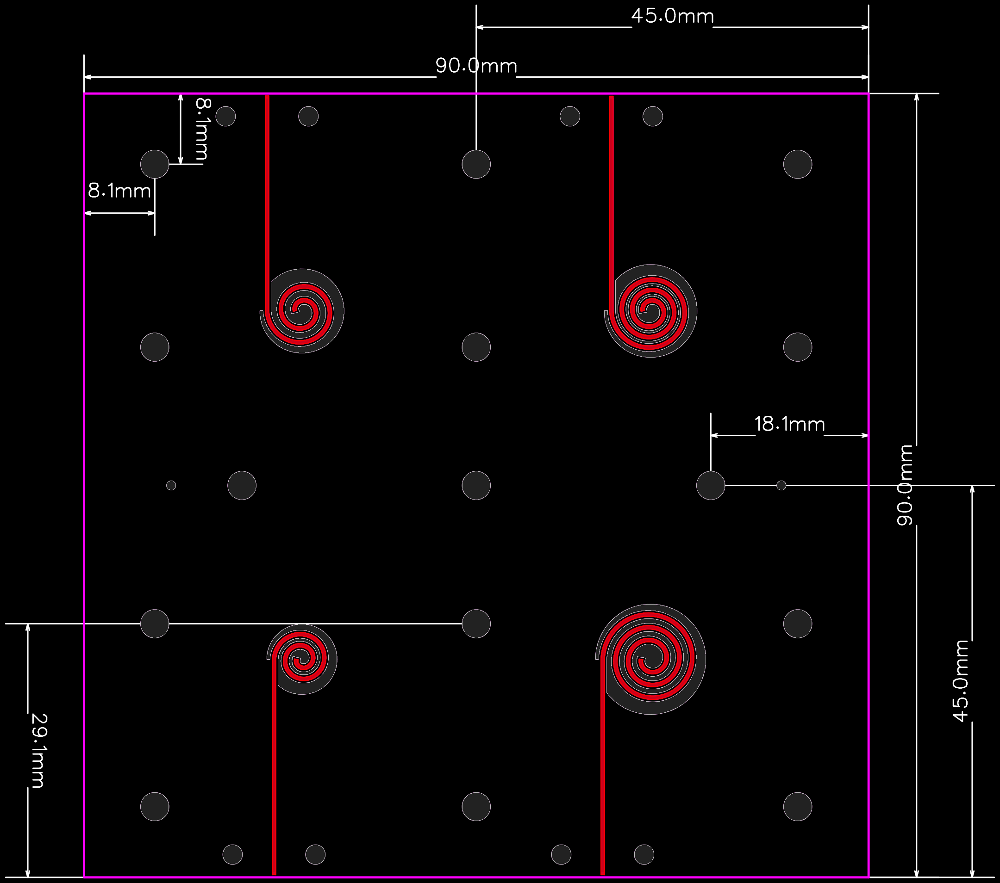

  <strong>English</strong> | <a href="README_zh.md">简体中文</a>

# Flexible Spiral Antenna

## Project Description

A solution for a universal flexible stretchable spiral antenna.
Four different spiral dimensions are shown in the figure below:

---

## License & Citation

### 1. Hardware License

This hardware design (including PCB Layout files and related manufacturing data) is licensed under the **CERN Open Hardware Licence Version 2 - Strongly Reciprocal (CERN-OHL-S v2)**.

You may freely distribute and modify the project files, provided that you **meet the following conditions**:
*   **Attribution Required**: You must clearly credit the original author and include a link to this repository in your derivative projects or documentation.
*   **Strongly Reciprocal (Copyleft)**: If you modify this antenna design (or integrate it into a larger hardware system), your newly released hardware design files must also be completely open-sourced under the CERN-OHL-S v2 license.

### 2. How to Cite

If you use this design in your academic research, engineering projects, or commercial products, please contact the author of this repository directly.
